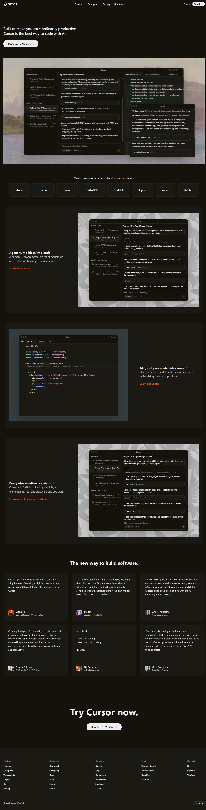

# Cursor Landing Page Recreation

This project is a recreation of the Cursor.com landing page, built using only HTML & CSS with a desktop-first approach.

## Overview

The goal was to replicate the visual hierarchy, structure & design of the Cursor website without using JavaScript, TailwindCSS, or external frameworks.

## Project Structure

```
cursor-landing-page/
│
├── index.html          # Main landing page HTML structure
├── style.css           # Styling (layout, typography, colors)
├── README.md           # Project documentation
│
└── assets/             # Images and brand resources
```

## Sections Recreated

**Top Navigation Bar**: Fixed position, blur effect, logo, links, and CTA.
**Hero Section**: Main headline, description, CTA buttons & product screenshot placeholder.
**Trusted By / Logos**: Row of company names using flexbox.
**Feature Sections**: Three blocks with alternating text/image layout.
**Testimonials**: Quote cards from developers.
**Final CTA**: Large call-to-action at the bottom.
**Footer**: Multi-column links.

### Typography

- **Primary Font**: "Segoe UI", Tahoma, Geneva, Verdana, sans-serif;

### Colors

- **Backgrounds**:
    - Primary: `#14120b` 
- **Text**:
    - Primary: `#ededed` 
    - Secondary: `#edededc4` 

### Layout Technique

- **Flexbox**: Used exclusively for layout structure.
    - `display: flex` used for all columns, alignments & positioning.


## Constraints Followed
- Pure HTML & CSS.
- No JavaScript.
- No TailwindCSS.
- Desktop-only design.

## Screenshots




